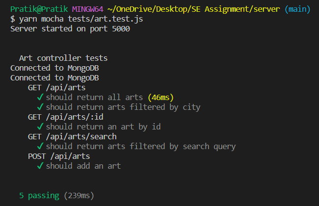
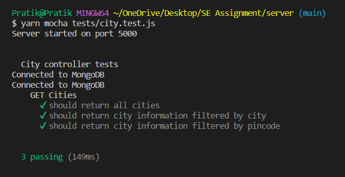

# Heritage Site - by Cities

A weekend software engineering assignment- Build a destination for heritage showcase and implement integration testing - using ChatGPT

## Run Locally

Start Server - Terminal 1

```bash
  cd server
  yarn
  yarn start
```

Start React App - Terminal 2

```bash
  cd client
  yarn
  yarn dev
```

## Running Tests

To run tests, run the following command

```bash
  cd server
  yarn mocha ./tests/art.test.js
  yarn mocha ./tests/city.test.js
```

## Screenshots

### Art controller tests -



### City controller tests -


